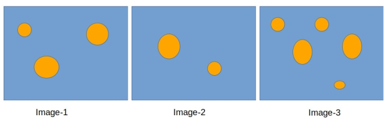

# Question 2

## Problem Statement

Consider the following sample images. Visually you can count that the number of objects in the images are 3, 2 and 5, respectively. Write a program that can take these images as inputs and report the number of objects as output. Assume that the objects are colored uniformly but different from the background which is also uniform. Do not assume the objects to be of same size or shape.

## Solution

**Language Used:** `python`

**Inputs:** [Example 1](Image-1.jpg), [Example 2](Image-2.jpg)

**Jupyter Notebook:** [Notebook](question_2.ipynb)

